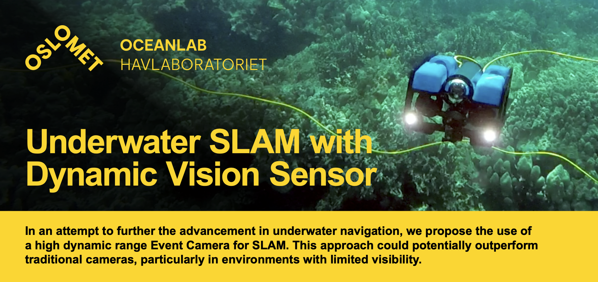

We aim to increase the access to this high-tech field, fueling advancements in underwater navigation. Get access to our dataset along with instructions on how to replicate our setup and feel free to contribute.
[Recorded Dataset](Docs/dataset.md) - Guide for using the recorded dataset:
[Software installation](Docs/installation.md)

### Content

| Section | Description |
| :--- | :--- |
| [BlueROV2 Setup](#bluerov2) | - |
| ---[Flash SD Card with latest software](#Flash-SD-Card-with-latest-software) | Update the ROV's companion pc to run BlueOS |
| ---[Configure additional streams](#Configure-additional-streams) | Open auxilliary ports to enable reading Video and MAVLink messages topside |
| ---[Activate Extensions for DVL and USB/IP](#Activate-Extensions) | Forward USB and integrate DVL with Pixhawk |
| [Top Side Computer Setup](#top-side-computer) | - |
| ---[Ubuntu 20.04 (Virtual Machine) (optional)](#ubuntu-2004-virtual-machine-optional) | Getting started with a KVM (virtual machine) |
| ---[Install basic tools](#Getting-started) | Enable building open source packages |
| ---[Increase Swap Drive (optional)](#increase-swap-drive-optional) | Increase available system memory by allocating from hdd |
| ---[ROS Noetic](#ros-noetic) | Enable working with rosbags and ROS messages |
| ---[Mavlink to ROS messages (MAVROS)](#mavlink-to-ros-mavros) | Read and process ROV telemetry data |
| ---[USB over IP support](#install-virtualhere-usb-over-ip-support) | Connect to a virtual USB port |
| ---[Event camera driver](#install-the-ros-enabled-event-camera-driver) | Publish event camera data as ROS messages |
| ---[DVL-A50 ROS driver](#DVL-A50-ROS-Driver) | Publish the system ground truth as ROS messages |
| ---[Ultimate SLAM](#install-ultimate-slam) | Run SLAM on event + frames + imu |
| ---[ORB SLAM 3](#Install-ORB-SLAM-3) | Run SLAM on frames + imu |
| ---[Kalibr Calibration Software](#calibration-software-if-using-your-own-equipment) | Obtain intrinsic parameters for SLAM on own camera |
| ---[Download resources](#Download) | App links and optional shell script to ease operations |

### Abstract
Paste abstract from final report here:

